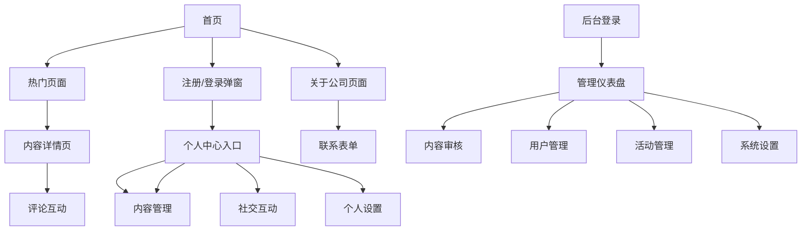

# Biubiustar社交媒体平台产品需求文档

## 1. 产品概述

Biubiustar社交媒体平台是一个基于前后台分离架构的现代化社交媒体平台，致力于为用户提供优质的内容分享和社交互动体验。平台支持图文视频内容发布、多级评论互动、用户关注等核心社交功能，并提供完善的后台管理系统。

平台面向全球用户，特别是东南亚地区用户，支持越南语、英语、中文简体、中文繁体四种语言，采用响应式设计确保在各种设备上的良好体验。

目标成为东南亚地区领先的社交媒体平台，为Biubiustar公司的数字文化产业布局提供重要支撑。

## 2. 核心功能

### 2.1 用户角色

| 角色 | 注册方式 | 核心权限 |
|------|----------|----------|
| 普通用户 | 邮箱/手机号注册 | 浏览内容、发布内容、互动评论、关注用户 |
| 管理员 | 系统分配账号 | 内容审核、用户管理、系统设置、数据统计 |

### 2.2 功能模块

我们的社交媒体平台需求包含以下主要页面：

1. **首页**：品牌展示区、热门内容预览、活动推荐、社区邀请区、语言切换
2. **热门页面**：热门内容列表、筛选功能、无限滚动加载
3. **关于公司页面**：企业介绍、发展时间轴、业绩展示、联系表单
4. **用户认证页面**：注册、登录、忘记密码功能
5. **个人中心**：个人概览、内容管理、社交互动管理、个人设置、消息通知
6. **内容详情页**：内容展示、评论互动、分享功能
7. **后台管理系统**：仪表盘、内容管理、用户管理、活动管理、系统设置

### 2.3 页面详情

| 页面名称 | 模块名称 | 功能描述 |
|----------|----------|----------|
| 首页 | 品牌展示区 | 展示Biubiustar品牌标识和核心价值主张，提供登录注册入口 |
| 首页 | 热门内容区 | 展示经过审核的优质帖子预览，包含互动数据和跳转链接 |
| 首页 | 活动推荐区 | 卡片式展示最新活动信息，包含活动详情和参与引导 |
| 首页 | 社区邀请区 | 展示社区邀请文案和行动按钮，引导用户注册和合作 |
| 热门页面 | 内容列表 | 按互动量排序展示优质内容，支持时间段和内容类型筛选 |
| 热门页面 | 无限滚动 | 实现无限滚动加载更多内容，提升用户浏览体验 |
| 关于公司页面 | 企业介绍区 | 展示公司简介、企业概况和发展战略 |
| 关于公司页面 | 发展时间轴 | 时间线形式展示公司发展历程和重要里程碑 |
| 关于公司页面 | 业绩展示区 | 展示2024年各阶段业绩数据 |
| 关于公司页面 | 联系表单 | 提供合作类目选择、联系信息填写和合作描述功能 |
| 用户认证弹窗 | 注册功能 | 支持邮箱/手机号注册，包含邮箱验证流程，弹窗形式展示 |
| 用户认证弹窗 | 登录功能 | 账号密码登录，支持记住登录状态，弹窗形式展示 |
| 用户认证弹窗 | 密码重置 | 通过邮箱重置密码功能，在登录弹窗中提供入口 |
| 顶部导航栏 | 登录状态切换 | 未登录时显示注册/登录按钮，登录后显示个人中心入口 |
| 个人中心 | 个人概览 | 展示个人信息、统计数据、最近活动和快速发布入口 |
| 个人中心 | 内容管理 | 管理已发布内容、草稿箱、发布新内容功能 |
| 个人中心 | 社交互动 | 管理点赞、评论、关注等社交互动记录 |
| 个人中心 | 个人设置 | 基础信息设置、隐私设置、账户安全、语言偏好 |
| 个人中心 | 消息通知 | 系统通知、互动通知、活动通知和通知设置 |
| 内容详情页 | 内容展示 | 展示图文视频内容，支持多媒体格式 |
| 内容详情页 | 评论系统 | 多级评论、@用户功能、评论管理 |
| 内容详情页 | 互动功能 | 点赞、分享、关注等社交互动功能 |
| 后台管理 | 仪表盘 | 关键数据展示、快速操作入口 |
| 后台管理 | 内容管理 | 内容审核、已发布内容管理、分类管理、多媒体管理 |
| 后台管理 | 用户管理 | 用户信息管理、批量操作、权限设置 |
| 后台管理 | 活动管理 | 活动发布管理、数据统计分析 |
| 后台管理 | 表单管理 | 联系合作表单管理、自定义表单构建 |
| 后台管理 | 系统设置 | 多语言管理、主题样式、网站信息、系统参数配置 |
| 后台管理 | 数据统计 | 访问统计、内容统计、用户统计分析 |
| 后台管理 | 系统运维 | 系统日志、数据备份、安全管理 |

## 3. 核心流程

### 普通用户流程
用户首先访问首页浏览热门内容和活动信息，可以通过语言切换选择合适的语言。未登录用户可以浏览公共内容，点击顶部导航的注册/登录按钮会弹出相应的认证弹窗。用户完成注册登录后，顶部导航会显示个人中心入口，可以发布内容、评论互动、关注其他用户。在个人中心可以管理自己的内容和设置，查看消息通知和数据统计。

### 管理员流程
管理员通过专门的后台登录入口进入管理系统，在仪表盘查看整体数据概览。主要工作包括审核用户提交的内容、管理用户账户、发布和管理活动、处理联系合作表单、配置系统设置等。管理员可以通过数据统计模块分析平台运营情况。

## 4. 用户界面设计

### 4.1 设计风格

- **主色调**：紫色系（#8B5CF6主色、#A855F7辅助色、#C084FC强调色）
- **按钮样式**：圆角现代化按钮，支持渐变紫色效果和悬停动画
- **字体**：优先使用系统字体，中文使用微软雅黑或苹方，英文使用Helvetica或Arial，字号16px为主体，14px为辅助
- **布局风格**：卡片式布局，顶部导航栏，左侧边栏（后台），响应式网格系统
- **图标样式**：线性图标风格，支持SVG格式，与紫色主题协调的图标色彩

### 4.2 页面设计概览

| 页面名称 | 模块名称 | UI元素 |
|----------|----------|--------|
| 首页 | 品牌展示区 | 大尺寸Logo、渐变紫色背景、现代化排版、突出的CTA按钮 |
| 首页 | 热门内容区 | 卡片式内容展示、缩略图、互动数据标签、悬停效果 |
| 首页 | 活动推荐区 | 活动卡片、时间标签、参与按钮、轮播或网格布局 |
| 热门页面 | 内容列表 | 瀑布流布局、筛选器、加载动画、无限滚动指示器 |
| 关于公司页面 | 时间轴 | 垂直时间线、里程碑节点、渐变连接线、卡片式内容 |
| 关于公司页面 | 联系表单 | 现代化表单设计、输入框聚焦效果、下拉选择器、提交按钮 |
| 用户认证弹窗 | 注册/登录弹窗 | 模态弹窗设计、半透明遮罩、居中显示、响应式布局、ESC键关闭 |
| 顶部导航栏 | 个人中心入口 | 用户头像、昵称显示、下拉菜单、悬停效果、退出登录功能 |
| 个人中心 | 概览面板 | 头像上传区、统计卡片、快速操作按钮、侧边导航 |
| 内容详情页 | 内容展示 | 响应式媒体播放器、标签系统、分享按钮组 |
| 后台管理 | 仪表盘 | 数据卡片、图表组件、快速操作面板、深色侧边栏 |

### 4.3 响应式设计

平台采用移动优先的响应式设计策略，确保在桌面端（1200px+）、平板端（768px-1199px）和手机端（<768px）都有良好的用户体验。移动端优化触摸交互，包括适当的按钮尺寸、手势支持和触摸反馈。桌面端充分利用屏幕空间展示更多内容和功能。