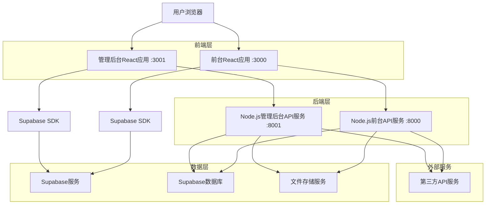
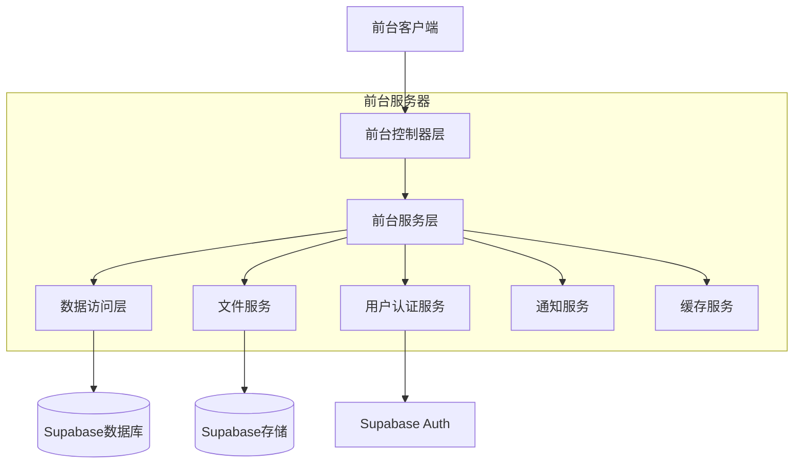
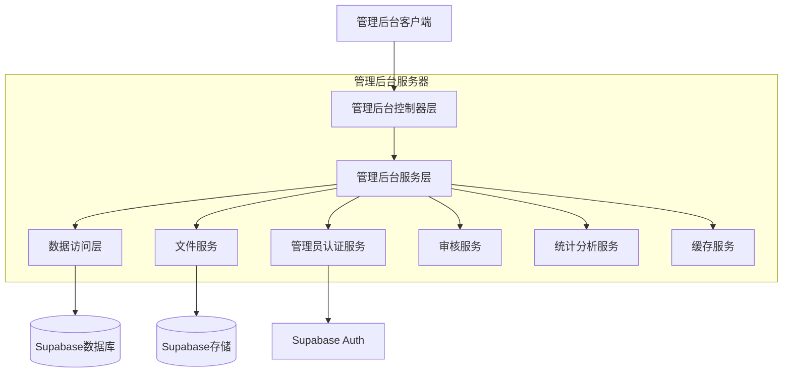
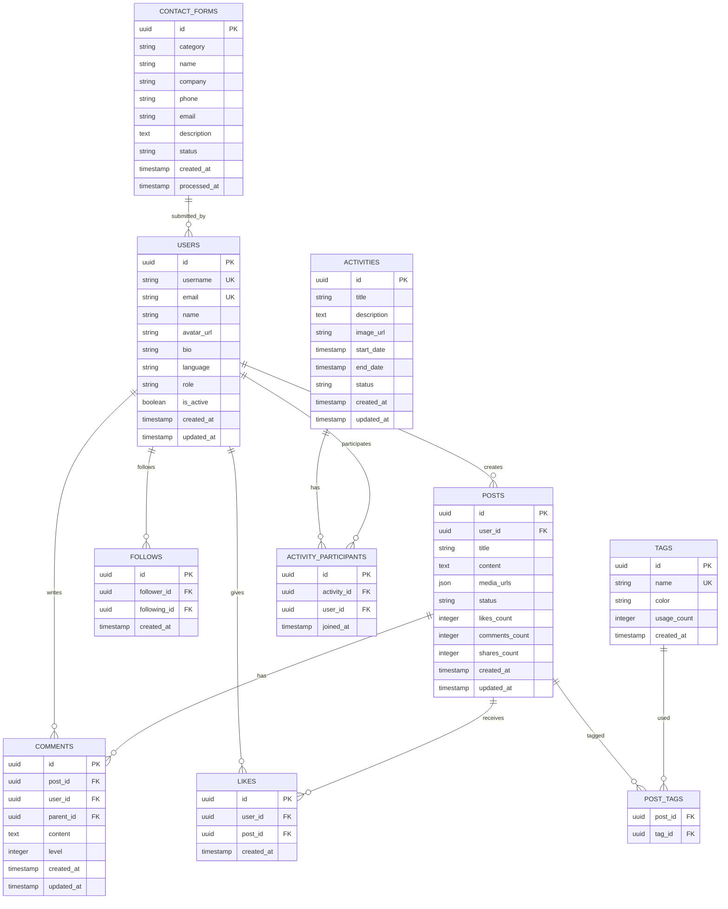

# Biubiustar社交媒体平台技术架构文档

## 1. 架构设计



## 2. 技术描述

### 2.1 前台应用 (端口: 3000)

* **前端**: React\@18 + TypeScript + Tailwind CSS + Vite + React Router

* **后端API**: Node.js + Express\@4 + TypeScript (端口: 8000)

* **认证**: Supabase Auth (支持用户名/邮箱登录，注册无需邮箱验证)

* **状态管理**: Zustand

* **UI组件**: Headless UI + 自定义组件

* **国际化**: react-i18next

### 2.2 管理后台应用 (端口: 3001)

* **前端**: React\@18 + TypeScript + Tailwind CSS + Vite + React Router

* **后端API**: Node.js + Express\@4 + TypeScript (端口: 8001)

* **认证**: Supabase Auth (管理员专用认证)

* **状态管理**: Zustand

* **UI组件**: Headless UI + 自定义组件

### 2.3 共享服务

* **数据库**: Supabase (PostgreSQL)

* **文件存储**: Supabase Storage

* **缓存**: Redis (可选)

## 3. 路由定义

### 3.1 前台应用路由 (localhost:3000)

| 路由                     | 用途                      |
| ---------------------- | ----------------------- |
| /                      | 首页，展示品牌信息、热门内容预览和活动推荐   |
| /hot                   | 热门页面，展示按互动量排序的优质内容      |
| /about                 | 关于公司页面，展示企业介绍、发展历程和联系表单 |
| /profile               | 个人中心首页，用户概览和快速操作        |
| /profile/posts         | 内容管理页面，管理已发布内容和草稿       |
| /profile/interactions  | 社交互动管理页面，管理点赞、评论、关注     |
| /profile/settings      | 个人设置页面，基础信息、隐私、安全设置     |
| /profile/notifications | 消息通知中心，系统和互动通知          |
| /post/:id              | 内容详情页面，展示具体内容和评论互动      |

**注意**: 登录、注册、密码重置功能通过弹窗组件实现，不占用独立路由

### 3.2 管理后台应用路由 (localhost:3001)

| 路由          | 用途                 |
| ----------- | ------------------ |
| /           | 后台管理登录页面           |
| /dashboard  | 管理仪表盘，关键数据展示和快速操作  |
| /content    | 内容管理页面，内容审核和管理     |
| /users      | 用户管理页面，用户信息和权限管理   |
| /activities | 活动管理页面，活动发布和数据统计   |
| /forms      | 表单管理页面，联系表单和自定义表单  |
| /settings   | 系统设置页面，多语言、主题、系统参数 |
| /analytics  | 数据统计页面，访问、内容、用户统计  |
| /system     | 系统运维页面，日志、备份、安全管理  |

## 4. API定义

### 4.1 前台API (localhost:8000)

**用户认证相关**

```
POST /api/auth/register
```

请求参数:

| 参数名      | 参数类型   | 是否必填  | 描述            |
| -------- | ------ | ----- | ------------- |
| username | string | true  | 用户名（唯一标识）     |
| email    | string | true  | 用户邮箱（无需验证码验证） |
| password | string | true  | 用户密码          |
| name     | string | true  | 用户昵称          |
| language | string | false | 首选语言          |

响应参数:

| 参数名     | 参数类型    | 描述     |
| ------- | ------- | ------ |
| success | boolean | 注册是否成功 |
| user    | object  | 用户信息   |
| message | string  | 响应消息   |

```
POST /api/auth/login
```

请求参数:

| 参数名        | 参数类型   | 是否必填 | 描述           |
| ---------- | ------ | ---- | ------------ |
| identifier | string | true | 登录标识（用户名或邮箱） |
| password   | string | true | 用户密码         |

响应参数:

| 参数名     | 参数类型    | 描述     |
| ------- | ------- | ------ |
| success | boolean | 登录是否成功 |
| user    | object  | 用户信息   |
| token   | string  | 访问令牌   |
| message | string  | 响应消息   |

**内容管理相关**

```
POST /api/posts
```

请求参数:

| 参数名     | 参数类型   | 是否必填  | 描述     |
| ------- | ------ | ----- | ------ |
| title   | string | true  | 内容标题   |
| content | string | true  | 内容正文   |
| media   | array  | false | 媒体文件列表 |
| tags    | array  | false | 标签列表   |
| status  | string | false | 发布状态   |

**社交互动相关**

```
POST /api/posts/:id/like
```

请求参数:

| 参数名    | 参数类型   | 是否必填 | 描述                 |
| ------ | ------ | ---- | ------------------ |
| action | string | true | 操作类型 (like/unlike) |

**联系表单相关**

```
POST /api/contact
```

请求参数:

| 参数名         | 参数类型   | 是否必填  | 描述    |
| ----------- | ------ | ----- | ----- |
| category    | string | true  | 合作类目  |
| name        | string | true  | 联系人姓名 |
| company     | string | false | 公司名称  |
| phone       | string | true  | 联系电话  |
| email       | string | true  | 邮箱地址  |
| description | string | false | 合作描述  |

示例请求:

```json
{
  "category": "直播电商",
  "name": "张三",
  "company": "示例公司",
  "phone": "+86 138 0000 0000",
  "email": "zhangsan@example.com",
  "description": "希望在直播电商领域开展合作"
}
```

### 4.2 管理后台API (localhost:8001)

**管理员认证相关**

```
POST /api/admin/auth/login
```

请求参数:

| 参数名      | 参数类型   | 是否必填 | 描述    |
| -------- | ------ | ---- | ----- |
| email    | string | true | 管理员邮箱 |
| password | string | true | 管理员密码 |

响应参数:

| 参数名     | 参数类型    | 描述     |
| ------- | ------- | ------ |
| success | boolean | 登录是否成功 |
| admin   | object  | 管理员信息  |
| token   | string  | 访问令牌   |
| message | string  | 响应消息   |

**内容审核管理**

```
PUT /api/admin/posts/:id/status
```

请求参数:

| 参数名    | 参数类型   | 是否必填  | 描述                               |
| ------ | ------ | ----- | -------------------------------- |
| status | string | true  | 审核状态 (approved/rejected/pending) |
| reason | string | false | 审核理由                             |

**用户管理**

```
GET /api/admin/users
```

查询参数:

| 参数名    | 参数类型    | 是否必填  | 描述    |
| ------ | ------- | ----- | ----- |
| page   | integer | false | 页码    |
| limit  | integer | false | 每页数量  |
| search | string  | false | 搜索关键词 |

```
PUT /api/admin/users/:id/status
```

请求参数:

| 参数名        | 参数类型    | 是否必填  | 描述     |
| ---------- | ------- | ----- | ------ |
| is\_active | boolean | true  | 用户激活状态 |
| reason     | string  | false | 操作理由   |

## 5. 服务器架构图

### 5.1 前台服务架构 (端口: 8000)



### 5.2 管理后台服务架构 (端口: 8001)



## 6. 数据模型

### 6.1 数据模型定义



### 6.2 数据定义语言

**用户表 (users)**

```sql
-- 创建用户表
CREATE TABLE users (
    id UUID PRIMARY KEY DEFAULT gen_random_uuid(),
    username VARCHAR(50) UNIQUE NOT NULL,
    email VARCHAR(255) UNIQUE NOT NULL,
    name VARCHAR(100) NOT NULL,
    avatar_url TEXT,
    bio TEXT,
    language VARCHAR(10) DEFAULT 'vi',
    role VARCHAR(20) DEFAULT 'user' CHECK (role IN ('user', 'admin')),
    is_active BOOLEAN DEFAULT true,
    created_at TIMESTAMP WITH TIME ZONE DEFAULT NOW(),
    updated_at TIMESTAMP WITH TIME ZONE DEFAULT NOW()
);

-- 创建索引
CREATE INDEX idx_users_username ON users(username);
CREATE INDEX idx_users_email ON users(email);
CREATE INDEX idx_users_role ON users(role);
CREATE INDEX idx_users_created_at ON users(created_at DESC);

-- 设置权限
GRANT SELECT ON users TO anon;
GRANT ALL PRIVILEGES ON users TO authenticated;
```

**内容表 (posts)**

```sql
-- 创建内容表
CREATE TABLE posts (
    id UUID PRIMARY KEY DEFAULT gen_random_uuid(),
    user_id UUID REFERENCES users(id) ON DELETE CASCADE,
    title VARCHAR(255) NOT NULL,
    content TEXT NOT NULL,
    media_urls JSON DEFAULT '[]',
    status VARCHAR(20) DEFAULT 'pending' CHECK (status IN ('draft', 'pending', 'approved', 'rejected')),
    likes_count INTEGER DEFAULT 0,
    comments_count INTEGER DEFAULT 0,
    shares_count INTEGER DEFAULT 0,
    created_at TIMESTAMP WITH TIME ZONE DEFAULT NOW(),
    updated_at TIMESTAMP WITH TIME ZONE DEFAULT NOW()
);

-- 创建索引
CREATE INDEX idx_posts_user_id ON posts(user_id);
CREATE INDEX idx_posts_status ON posts(status);
CREATE INDEX idx_posts_created_at ON posts(created_at DESC);
CREATE INDEX idx_posts_likes_count ON posts(likes_count DESC);

-- 设置权限
GRANT SELECT ON posts TO anon;
GRANT ALL PRIVILEGES ON posts TO authenticated;
```

**评论表 (comments)**

```sql
-- 创建评论表
CREATE TABLE comments (
    id UUID PRIMARY KEY DEFAULT gen_random_uuid(),
    post_id UUID REFERENCES posts(id) ON DELETE CASCADE,
    user_id UUID REFERENCES users(id) ON DELETE CASCADE,
    parent_id UUID REFERENCES comments(id) ON DELETE CASCADE,
    content TEXT NOT NULL,
    level INTEGER DEFAULT 1 CHECK (level <= 3),
    created_at TIMESTAMP WITH TIME ZONE DEFAULT NOW(),
    updated_at TIMESTAMP WITH TIME ZONE DEFAULT NOW()
);

-- 创建索引
CREATE INDEX idx_comments_post_id ON comments(post_id);
CREATE INDEX idx_comments_user_id ON comments(user_id);
CREATE INDEX idx_comments_parent_id ON comments(parent_id);
CREATE INDEX idx_comments_created_at ON comments(created_at DESC);

-- 设置权限
GRANT SELECT ON comments TO anon;
GRANT ALL PRIVILEGES ON comments TO authenticated;
```

**点赞表 (likes)**

```sql
-- 创建点赞表
CREATE TABLE likes (
    id UUID PRIMARY KEY DEFAULT gen_random_uuid(),
    user_id UUID REFERENCES users(id) ON DELETE CASCADE,
    post_id UUID REFERENCES posts(id) ON DELETE CASCADE,
    created_at TIMESTAMP WITH TIME ZONE DEFAULT NOW(),
    UNIQUE(user_id, post_id)
);

-- 创建索引
CREATE INDEX idx_likes_user_id ON likes(user_id);
CREATE INDEX idx_likes_post_id ON likes(post_id);
CREATE INDEX idx_likes_created_at ON likes(created_at DESC);

-- 设置权限
GRANT SELECT ON likes TO anon;
GRANT ALL PRIVILEGES ON likes TO authenticated;
```

**关注表 (follows)**

```sql
-- 创建关注表
CREATE TABLE follows (
    id UUID PRIMARY KEY DEFAULT gen_random_uuid(),
    follower_id UUID REFERENCES users(id) ON DELETE CASCADE,
    following_id UUID REFERENCES users(id) ON DELETE CASCADE,
    created_at TIMESTAMP WITH TIME ZONE DEFAULT NOW(),
    UNIQUE(follower_id, following_id),
    CHECK (follower_id != following_id)
);

-- 创建索引
CREATE INDEX idx_follows_follower_id ON follows(follower_id);
CREATE INDEX idx_follows_following_id ON follows(following_id);
CREATE INDEX idx_follows_created_at ON follows(created_at DESC);

-- 设置权限
GRANT SELECT ON follows TO anon;
GRANT ALL PRIVILEGES ON follows TO authenticated;
```

**联系表单表 (contact\_forms)**

```sql
-- 创建联系表单表
CREATE TABLE contact_forms (
    id UUID PRIMARY KEY DEFAULT gen_random_uuid(),
    category VARCHAR(50) NOT NULL,
    name VARCHAR(100) NOT NULL,
    company VARCHAR(200),
    phone VARCHAR(50) NOT NULL,
    email VARCHAR(255) NOT NULL,
    description TEXT,
    status VARCHAR(20) DEFAULT 'pending' CHECK (status IN ('pending', 'processing', 'completed')),
    created_at TIMESTAMP WITH TIME ZONE DEFAULT NOW(),
    processed_at TIMESTAMP WITH TIME ZONE
);

-- 创建索引
CREATE INDEX idx_contact_forms_status ON contact_forms(status);
CREATE INDEX idx_contact_forms_created_at ON contact_forms(created_at DESC);
CREATE INDEX idx_contact_forms_category ON contact_forms(category);

-- 设置权限
GRANT SELECT ON contact_forms TO anon;
GRANT ALL PRIVILEGES ON contact_forms TO authenticated;
```

**初始化数据**

```sql
-- 插入管理员用户
INSERT INTO users (username, email, name, role, language) VALUES 
('admin', 'admin@biubiustar.com', 'System Admin', 'admin', 'vi'),
('demo', 'demo@biubiustar.com', 'Demo User', 'user', 'vi');

-- 插入示例标签
INSERT INTO tags (name, color) VALUES 
('直播', '#8B5CF6'),
('短视频', '#A855F7'),
('娱乐', '#C084FC'),
('科技', '#7C3AED'),
('生活', '#9333EA');
```

